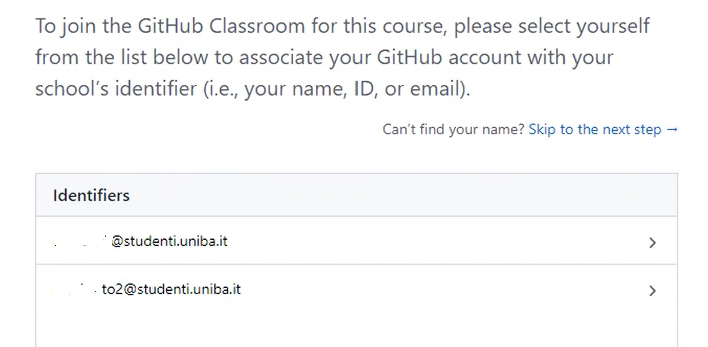
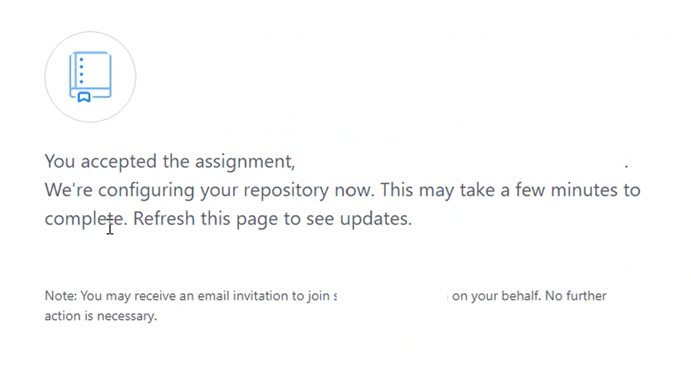
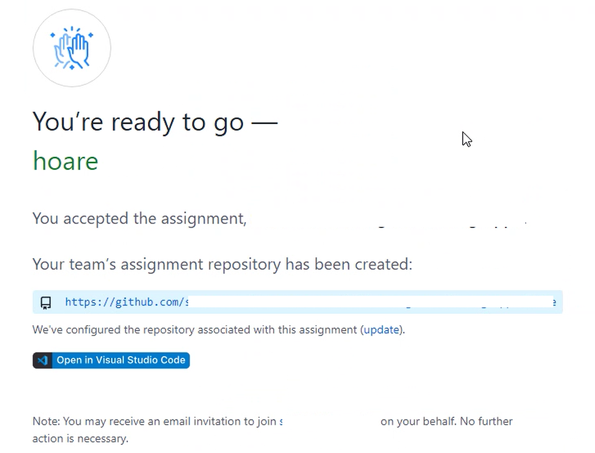
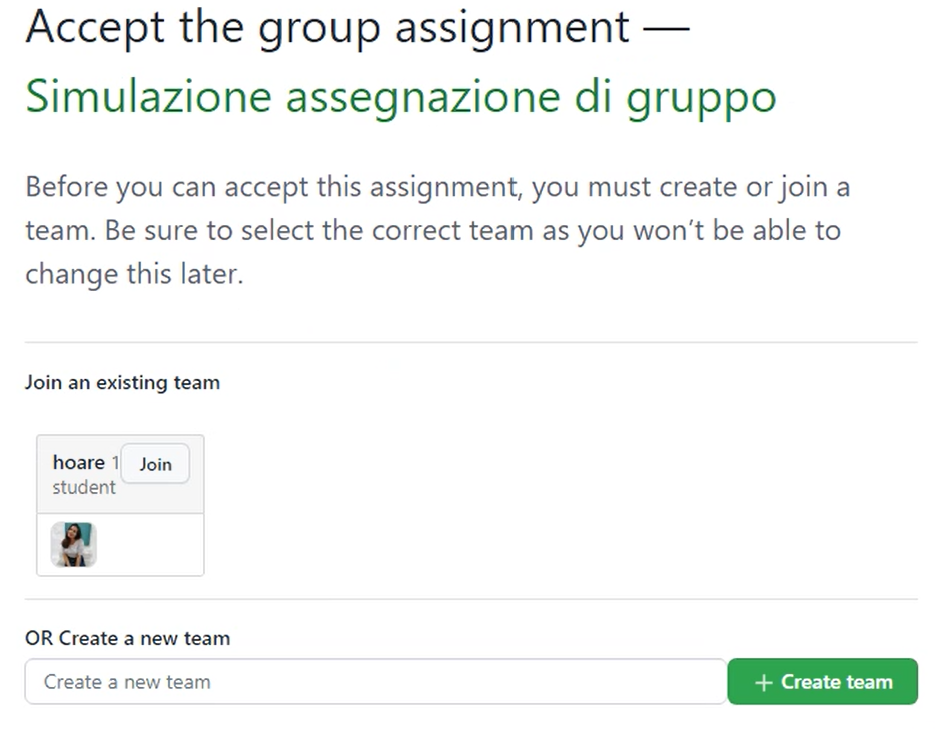
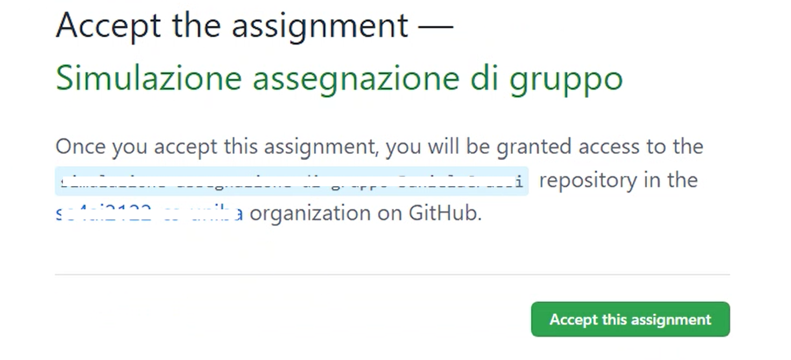
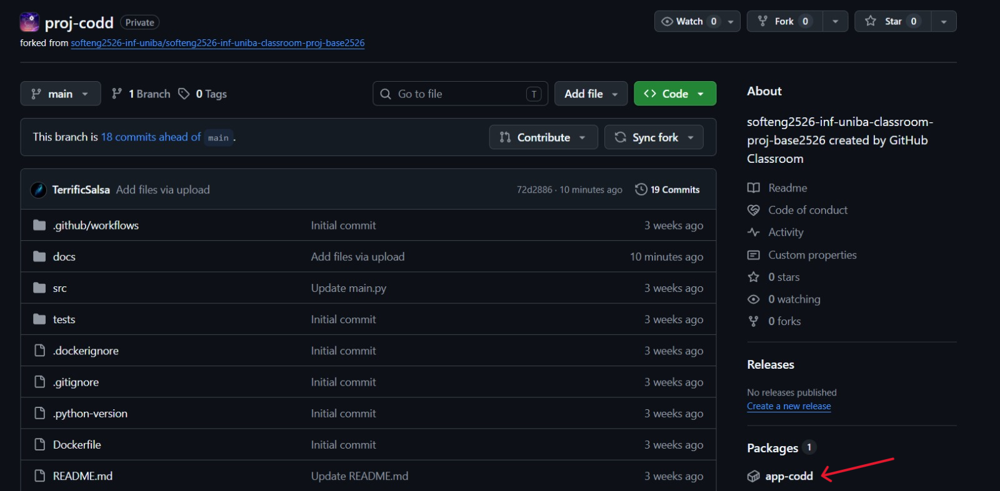
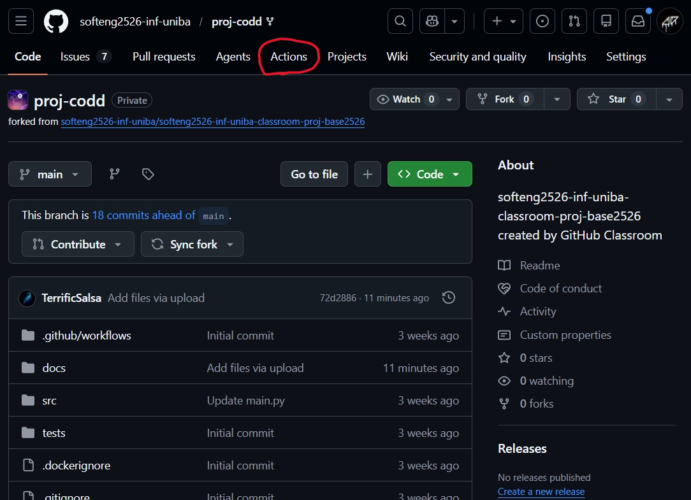
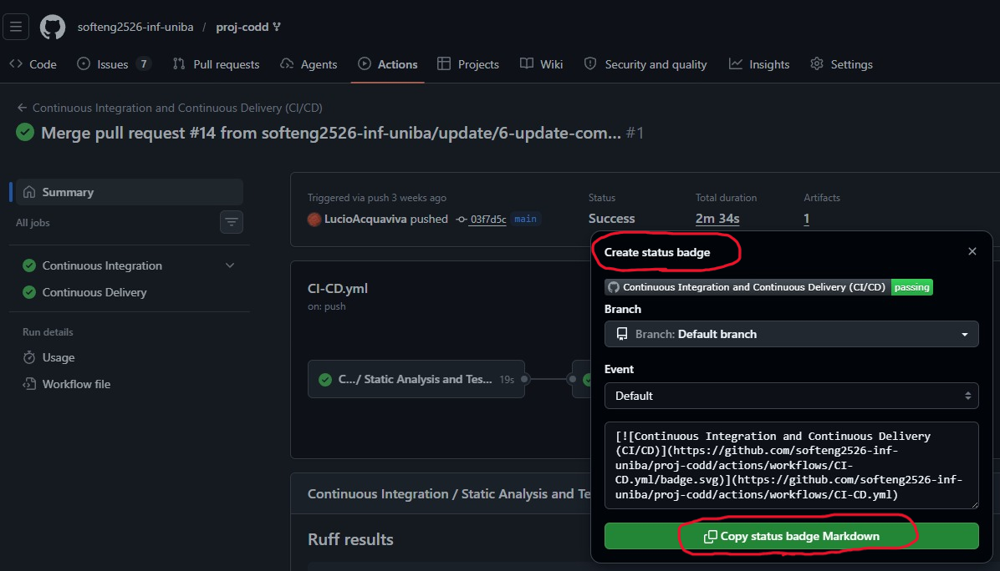
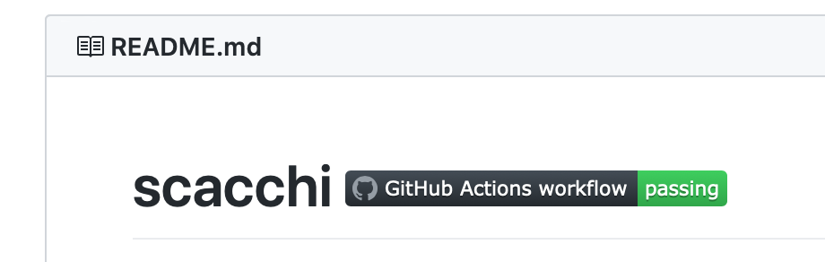

# Guida alla configurazione del repository

## Indice

- [Accettazione assignment del primo componente e creazione repository su GitHub](#accettazione-assignment-del-primo-componente-e-creazione-repository-su-github)
- [Accettazione assignment degli altri componenti e accesso al repository su GitHub](#accettazione-assignment-degli-altri-componenti-e-accesso-al-repository-su-github)
- [Configurazione del repository su GitHub](#configurazione-del-repository-su-github)
  - [Abilitazione package/immagini Docker](#abilitazione-packageimmagini-docker)
  - [Aggiunta del badge di GitHub Actions nel README](#aggiunta-del-badge-di-github-actions-nel-readme)

## Accettazione assignment del primo componente e creazione repository su GitHub

Mettersi d'accordo su chi sarà il primo componente del gruppo che accetterà l'*assignment* su GitHub Classroom.

**Le seguenti azioni sono di responsabilità del componente designato dal gruppo**:

- Il componente designato dal gruppo dovrà scrivere sul canale `Formazione gruppi` di Teams un messaggio rivolto al docente (usare il *mention* con *@*) dichiarando che "il gruppo *x* è pronto" dove *x* è il nome del gruppo.
- Il docente risponderà inviando allo studente in chat privata il link di assegnazione del progetto.
- Cliccare sul link di assegnazione del progetto che il docente ha inviato in chat privata su Teams.
- Scorrere la lista e cliccare sul proprio indirizzo di email
  

- Creare il team scrivendo il nome prescelto e cliccando sul pulsante verde `Create team`.
- Aspettare che GitHub Classroom cloni il repository base per il vostro team.
  
- *Fare un refresh della pagina web per verificare il completamento.*
  

- Comunicare al docente in chat l'esito della creazione.
- Comunicare agli altri componenti del gruppo il link di assegnazione del progetto precedentemente inviato dal docente.

## Accettazione assignment degli altri componenti e accesso al repository su GitHub

**Le seguenti azioni sono di responsabilità di tutti i componenti tranne quello designato per la creazione del repository**:

- Cliccare sul link di assegnazione del progetto ricevuto dal collega designato.
- Scorrere la lista e cliccare sul proprio indirizzo di email
  

- Unirsi al proprio team cliccando il corrispondente pulsante `Join`
   

**Se non si trova il team, è probabile che l'assignment sia stato accettato prima della creazione del team. Fermarsi e avvisare il componente designato dal gruppo.**

- Se ci si è uniti a un team già creato, sarà necessario prima confermare la scelta e quindi si riceverà subito la conferma.
   

- Questo passo terminerà con successo se tutti i componenti del gruppo potranno accedere al repository.

## Configurazione del repository su GitHub

Il repository che vi è stato assegnato contiene tutto il necessario per cominciare lo sviluppo della vostra applicazione. Oltre a una versione base del codice sorgente, esso presenta la struttura di directory alla quale dovrete attenervi durante lo svolgimento del progetto e i file di configurazione per i principali strumenti inclusi nella pipeline.

In particolare, in `.github/workflows`, trovate due file di configurazione di GitHub Actions, denominati `CI.yml` e `CI-CD.yml`. [Actions](https://github.com/features/actions) è una funzionalità di GitHub che consente la definizione e l'esecuzione automatizzata di pipeline di Continuous Integration / Continuous Deployment (CI/CD). In GitHub Actions, i passaggi di una pipeline vengono specificati in un file `.yml`, detto *workflow*. Generalmente, le pipeline di CI/CD comprendono operazioni di testing, releasing e deployment di un sistema software. Nello specifico,
per il vostro progetto sono state definite due pipeline.

La prima pipeline, definita nel file `CI.yml`, viene innescata da ogni Pull Request e realizza i seguenti passaggi:

1. il testing del vostro codice (unit test con [Pytest](https://pytest.org/));
2. l'analisi dello stesso con strumenti di quality assurance ([Ruff](https://docs.astral.sh/ruff/)).

La seconda pipeline, definita nel file `CI-CD.yml`, viene innescata dalle operazioni di push e merge sul branch `main`; oltre a svolgere gli stessi passaggi effettuati dalla prima, effettua la costruzione di un'immagine Docker con la vostra applicazione e il caricamento della stessa su [GitHub Packages](https://github.com/features/packages).

**N.B.**: entrambi i workflow si attivano soltanto se le modifiche nei commit riguardano file contenuti nelle cartelle `src/` e `tests/` del repository o il file `pyproject.toml`. In questo modo evitiamo che i workflow si attivino anche in caso di modifiche minori che non avrebbero alcun effetto sul funzionamento del vostro programma (ad esempio, modifiche al file `README.md` o alla documentazione).

## Abilitazione package/immagini Docker

Affinché tutti i membri del team possano visualizzare e scaricare l'immagine Docker del proprio progetto da GitHub Packages, è necessario che il componente designato svolga i seguenti passaggi.

1. Accedere al proprio repository su GitHub.
2. Cliccare sulla tab *"Actions"* (subito sotto il titolo, in alto al centro) e verificare che il workflow `CI-CD.yml` sia stato eseguito con successo almeno una volta. 
**N.B.**: il workflow si attiva automaticamente dopo aver effettuato un'operazione di merge o push sul branch `main` contenente una o più modifiche ai file presenti nelle cartelle `src/` o `tests/`. Attendere che il workflow risulti eseguito con successo prima di proseguire con i passaggi successivi.
3. Verificare che il package contenente la vostra immagine Docker sia stato correttamente associato al vostro repository.
   - Se l'associazione è avvenuta correttamente, vedrete il link al package nella barra laterale destra della pagina principale del repository, sotto l'intestazione "Packages"
(vedi freccia rossa in figura). 
   - In caso contrario, è necessario procedere con un'associazione manuale. Per farlo:
     -  visitare la [pagina con l'elenco dei package associati all'organizzazione del corso](https://github.com/orgs/softeng2526-inf-uniba/packages).
     -  Cercare il package con il nome del proprio team e fare click sul titolo per entrare nella pagina dedicata.
     -  Scorrere in basso nella pagina e fare click sul bottone "Connect Repository".
     -  Nella finestra di dialogo, cercare e selezionare il vostro repository.
     -  Concludere l'operazione cliccando sul bottone "Connect Repository". A questo punto, tornando nella pagina principale del vostro repository, dovreste vedere il link al package nella barra laterale destra.

## Aggiunta del badge di GitHub Actions nel README

Per aggiungere il badge che riporta l'ultimo esito dell'esecuzione del workflow `CI-CD.yml` (stato del workflow) all'interno del file README del vostro repository, attenersi alle seguenti istruzioni:

- entrare nella pagina principale del repository e cliccare su `Actions` (subito sotto il titolo, in alto al centro);

- la pagina *"All workflows"* sotto la tab *"Actions"*, riporta l'elenco delle esecuzioni (*run*) di tutti i workflow di GitHub Actions attivabili nel repository; per filtrarne il contenuto e visualizzare soltanto le esecuzioni relative al workflow `CI-CD.yml`, fare click sulla voce corrispondente nel pannello laterale a sinistra. (**N.B.**: all'inizio del progetto, è del tutto normale che queste liste siano vuote; come già detto, il workflow `CI-CD.yml` si attiverà per la prima volta quando modificherete il codice nelle cartelle `src/` o `tests/` ed effettuerete Pull Request o operazioni di push/merge sul branch `main`);
- Una volta selezionato il workflow `CI-CD.yml` dal pannello laterale, in alto a destra nella pagina – di fianco alla text box con la scritta "Filter workflow runs" – comparirà un nuovo bottone con tre puntini `•••`. Fare click su tale bottone e poi selezionare la voce "Create status badge" nel menù a tendina.
- Lasciando invariate le impostazioni di default (`branch` e `event`) nella finestra a comparsa, fare click su `Copy status badge Markdown`;
  
- La modifica del file Markdown `README.md` sarà fatta come parte dei task dello *Sprint 0* incollando il codice markdown per la costruzione del badge in cima al `README.md`, accanto al titolo del repository.

Il titolo del README.md apparirà come nella seguente figura:

Il colore e lo stato del badge potranno cambiare dopo ogni build, riflettendo lo stato del progetto.

